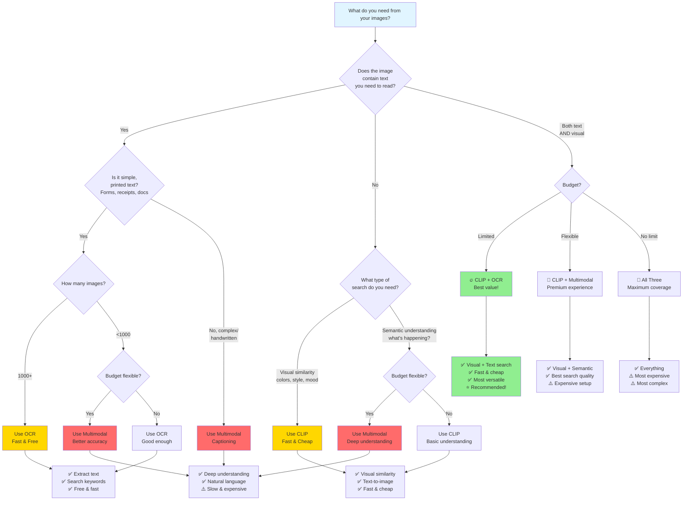

# base-llm-client

Skip making boilerplate of setting up LLM client for langchain projects.

IIRC installing clip takes 1 more step.¯\\_(ツ)_/¯

---

### Function Categories

| Category             | Functions                                                                             |
| -------------------- | ------------------------------------------------------------------------------------- |
| **LLMs**             | `get_llm()`, `get_image_llm()`                                                        |
| **Embeddings**       | `get_text_embeddings()`, `get_image_embeddings()`, `get_image_embeddings_langchain`   |
| **Loaders**          | `ImageLoader`                                                                         |
| **Image Processing** | `generate_image_caption()`, `extract_text_from_image()`, `extract_text_from_images()` |
| **Hybrid**           | `process_images_with_clip_and_ocr()`, `process_images_with_clip_and_captions()`       |
| **Utilities**        | `load_images_from_directory()`                                                        |

---

### Provider Configuration

| Provider       | LLM | Text Embeddings | Image Embeddings | Multimodal |
| -------------- | --- | --------------- | ---------------- | ---------- |
| **OpenAI**     | ✅  | ✅              | Via Replicate    | ✅         |
| **Anthropic**  | ✅  | ❌              | Via Replicate    | ✅         |
| **Ollama**     | ✅  | ✅              | ❌               | ✅         |
| **Local CLIP** | ❌  | ❌              | ✅               | ❌         |
| **Replicate**  | ❌  | ❌              | ✅               | ❌         |

---

### Decision Flowchart for image processing

---

### ToDo

- [ ] verify mix'n matching different models works (have not thoroughly tested anthropic)
- [ ] verify CLIP install process
- [ ] make docs
  - [ ] make example for each function
